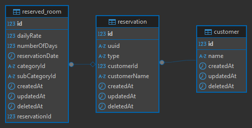

# Projeto de Mensageria para Sistema de Reservas de Hotel

## Alunos
 - João Pedro Borges Araújo
 - Raul Silva Araújo

## 📌 **Contexto do Projeto**
Este projeto faz parte da disciplina **Computação em Nuvem 2** no curso de **Desenvolvimento de Software Multiplataforma** na **FATEC**.  
O objetivo é implementar um sistema de mensageria que consuma dados de reservas de um sistema de hotelaria, persistindo essas informações em um banco de dados relacional e disponibilizando uma API para consulta dessas reservas.

---

## 📊 **Modelo de Dados (DER)**
O modelo de dados foi estruturado com três tabelas principais:

- **customer** → Representa o cliente que faz a reserva.
- **reservation** → Contém os detalhes da reserva, incluindo o cliente associado.
- **reserved_room** → Detalha os quartos reservados e os valores relacionados à reserva.

**Diagrama do Banco de Dados:**  


---

## 🚀 **Funcionalidades**
### ✅ **Consumidor de Mensageria**
- Consumir dados de reservas de um sistema externo de hotelaria.
- Persistir os dados em um banco de dados relacional com as seguintes informações:
  - **Tabela `customer`** → Informações do cliente.
  - **Tabela `reservation`** → Informações da reserva.
  - **Tabela `reserved_room`** → Informações sobre os quartos reservados.

### ✅ **Registro de Horário**
- O sistema registra a hora em que a mensagem foi armazenada no banco de dados para auditoria.

---

### ✅ **API de Consulta**
Foi desenvolvida uma API REST para consulta das reservas armazenadas no banco de dados.

- **Método:** `GET`
- **Endpoint:** `/reserves`
- **Filtros disponíveis:**
  - `uuid` → Identificador único da reserva.
  - `customerId` → Identificador do cliente.
  - `reservationId` → Identificador da reserva.
  
#### **Exemplo de Payload de Retorno:**
```json
{
   "uuid": "3030-499f-39f949",
   "created_at": "2023-09-01 22:33:00",
   "type": "AB",
   "customer": {
       "id": 99494,
       "name": "João da Silva"
   },
   "rooms": [
       {
           "id": 1,
           "daily_rate": 300.00,
           "number_of_days": 3,
           "reservation_date": "2025-09-15",
           "category": {
               "id": "AM",
               "sub_category": {
                   "id": "BCRU"
               }
           }
       },
       {
           "id": 44,
           "daily_rate": 500.00,
           "number_of_days": 2,
           "reservation_date": "2026-09-15",
           "category": {
               "id": "BA",
               "sub_category": {
                   "id": "ABCD"
               }
           }
       }
   ]
}
